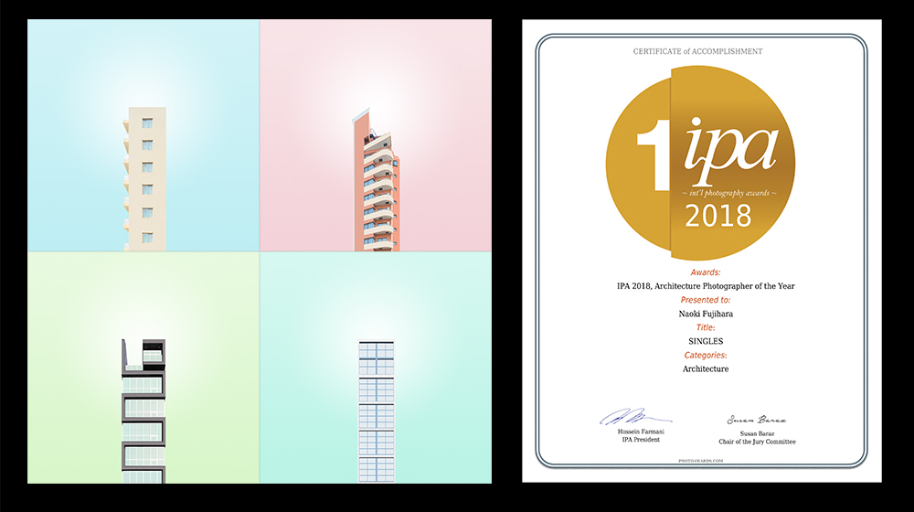
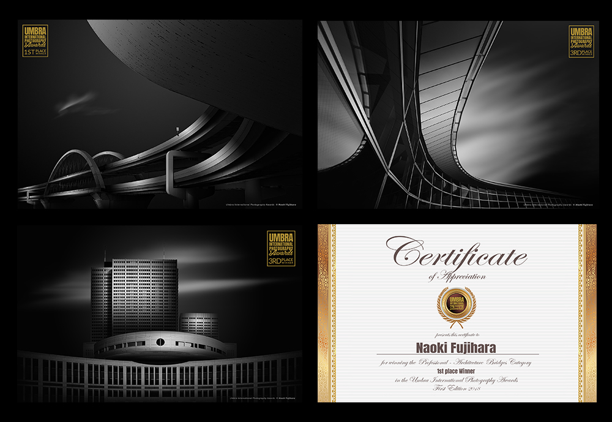

# About

####  Naoki Fujihara – Architecture Photographer of the Year on IPA 2018

Naoki Fujihara is an award-winning fine art photographer living in Japan. His works aim at not only expressing the beauty and dynamism of architectures, but he also expresses his values or his life experiences with photography. His photographs were awarded some international photography competitions.

## Awards List

・2019, <a href="https://www.umbrawards.com/professional?lightbox=dataItem-keokuvng2">UMBRA International Photography Competition</a> &#8211; 1st &amp; 3rd Place（Architecture）

・2018, <a href="https://ndawards.net/winners-gallery/nd-awards-2018/non-professional/buildings/hm/8424">ND Photography Awards</a> – Honorable Mention（Architecture）

・2018, <a href="https://www.thespiderawards.com/gallery/13th/professional/architectural/winners/199486">13th Black &amp; White Spider Awards</a> &#8211; Nominee（Architecture）

・2018, <a href="https://www.photoawards.com/winner/zoom.php?eid=8-158888-18">IPA International Photography Awards</a> &#8211; Architecture Photographer of the Year &amp; 1st Place（Architecture）

・2018, <a href="https://www.photoawards.com/winner/zoom.php?eid=8-156541-18">IPA International Photography Awards</a> &#8211; Honorable Mention（Architecture）

・2018, <a href="https://px3.fr/winners/px3/2018/9438/">PX3 Prix de la Photographie de Paris</a> &#8211; Gold（Advertising/Architecture）

・2018, <a href="https://www.moscowfotoawards.com/winners/moscow/2018/4053/">MIFA Moscow International Foto Awards</a> &#8211; Gold and Silver（Architecture）

・2018, <a href="https://oneeyeland.com/japan-top10-black-and-white-photographers-2018">One Eyeland World's TOP 10 Black &amp; White Photographers</a> &#8211; JAPAN Rank #3

・2018, <a href="https://fineartphotoawards.com/winners-gallery/fapa-2017-2018/amateur/architecture/hm/6648">FAPA Fine Art Photography Awards</a> &#8211; Honorable Mention（Architecture）

・2017, <a href="https://oneeyeland.com/awards/award_images.php?award_id=3689&amp;cat=architecture&amp;year=2017">One Eyeland Awards</a> &#8211; Finalist

・2017, <a href="https://www.tokyofotoawards.jp/winners/hm/2017/23-9884-18/">TIFA Tokyo International Foto Awards</a> &#8211; Honorable Mention（Architecture）

・2017, <a href="https://monoawards.com/winners-gallery/monochrome-awards-2017/amateur/architecture/hm/6452"> Monochrome Awards</a> &#8211; Honorable Mention

・2017, <a href="https://iphotographeroftheyear.com/winners-gallery/ipoty-2017/amateur/bridges/show/hm/2773"> IPOTY International Photographer of The Year</a> &#8211; Honorable Mention

## Publications

・2019, Tokyo Camera Club in Tokyo, Japan / A photo book titled "<a href="https://natgeo.nikkeibp.co.jp/atcl/product/19/051500019/">This cruel yet beloved world</a>"

・2019, 6th issue of <a href="http://fineeyemagazine.weebly.com/issues/issue-01-2019">Fine Eye Magazine</a>, a fine art photography magazine.

・2018, 16th issue of <a href="https://shadesofgreymagazine.com/product/shades-of-grey-magazine-n16/">Shades of Grey Magazine</a>, a black and white photography magazine.

・2018, 5th issue of <a href="https://issuu.com/eye-photomagazine/docs/fem__issue__05__2018__issuu/138">Fine Eye Magazine</a>, a fine art photography magazine.

・2018, 13th issue of <a href="https://minimalismmag.com/2018/10/10/bw-minimalism-magazine-13/">Minimalism</a>, a black and white photography magazine.

・2018, <a href="http://monovisions.com/naoki-fujihara-interview-with-architecture-photographer/">MONOVISION</a>, a black and white photography magazine.

・2018, A catalog for the exhibition “<a href="http://www.blurb.com/b/8730949-black-white">Black and White 2018</a>” &#8211; Blank Wall Gallery in Athens, Greece.

・2018, Tokyo Camera Club in Tokyo, Japan / A photo book titled "The world is more beautiful than we think."

## Exhibitions

・2019, <a href="https://tokyocameraclub.com/special/exhibition_2019/">Tokyo Camera Club Photo Exhibition</a> &#8211; Tokyo, Japan

・2018, <a href="http://www.blankwallgallery.com/exhibition-black-white-2019/#jp-carousel-8889">Black and White</a> &#8211; Blank Wall Gallery, Athens, Greece

・2018, <a href="http://www.cipfestival.com/3-naoki-fujihara/">Chania International Photo Festival</a> &#8211; Chania, Greece

・2018, <a href="https://tokyocameraclub.com/special/exhibition_2018/">Tokyo Camera Club Photo Exhibition</a> &#8211; Tokyo, Japan

## Portfolio

2019, UMBRA International Photography Competition – 1st & 3rd Place（Architecture）

